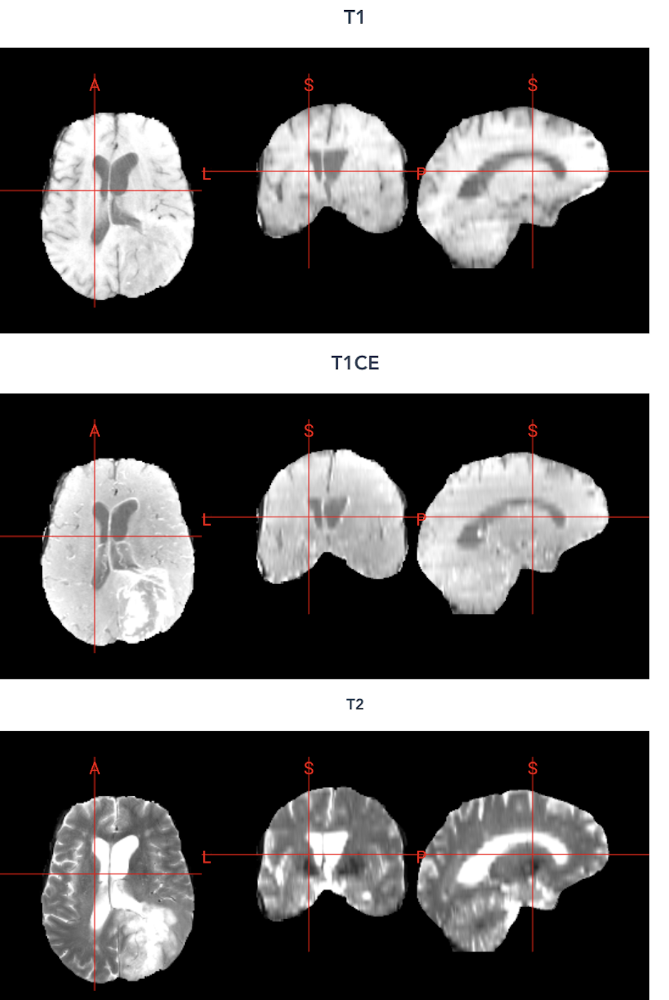
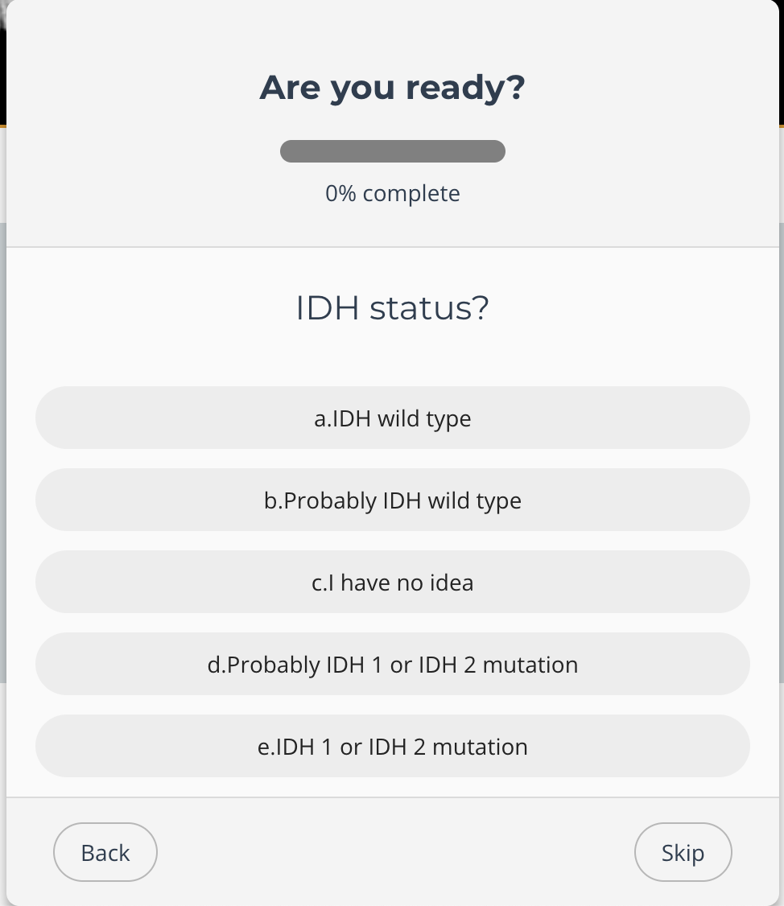
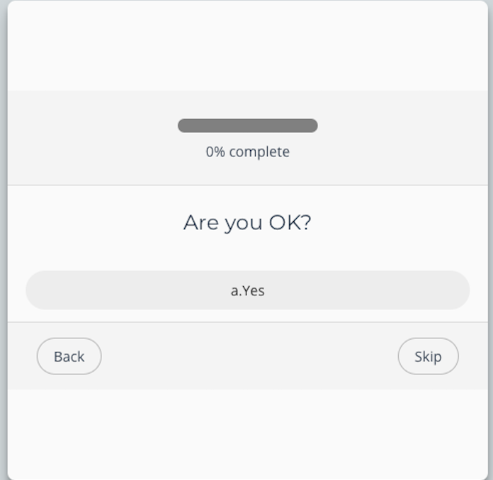

# HumanVSAIPub: Brain Tumor IDH Status Identification

This repository contains the software used for the research paper:

**"Comparative study of the performance of artificial intelligence and human physicians in predicting isocitrate dehydrogenase mutation status in glioblastoma using magnetic resonance imaging"**

A desktop application for testing and training identification of IDH mutation status in brain tumors using multi-modal MRI images.



## Overview

This application is designed to help medical professionals and researchers train and test their ability to identify IDH mutation status in brain tumors using MRI imaging data. IDH mutation status is a critical biomarker for brain gliomas that significantly impacts patient prognosis and treatment planning.

The project consists of two Electron applications:

1. **viteElectronTCGAtest**: For testing identification skills
2. **viteElectronTCGAtrain**: For training and practice

Each application displays brain MRI scans in four different modalities (T1, T1CE, T2, FLAIR) and asks users to identify the IDH mutation status of the tumor.


*Test interface: Displaying an IDH wild type case*


*Training interface: User confirmation screen*

## Features

- Display of multi-modal MRI scans (T1, T1CE, T2, FLAIR)
- Interactive quiz interface
- Progress tracking
- Results export as JSON
- Built with Electron and Vue.js for cross-platform compatibility
- Uses NiiVue for medical image visualization

## Installation

### Prerequisites

- Node.js (v14 or higher)
- npm (v6 or higher)

### Setup

1. Clone the repository:
   ```
   git clone https://github.com/yourusername/HumanVSAIPub.git
   cd HumanVSAIPub
   ```

2. Install dependencies for both applications:
   ```
   # For the test application
   cd viteElectronTCGAtest
   npm install
   
   # For the training application
   cd ../viteElectronTCGAtrain
   npm install
   ```

3. **Important:** Due to copyright restrictions, the MRI image data is not included in this repository. You will need to:
   - Obtain appropriate brain MRI data (NIFTI format: .nii or .nii.gz)
   - Place the data in the appropriate directory structure (see below)

### Data Setup

For each application, you'll need to place your data in the following directory structure:

```
/viteElectronTCGAtest/src/renderer/data/
└── [Case ID]/
    ├── T1.nii.gz
    ├── T1CE.nii.gz
    ├── T2.nii.gz
    └── FLAIR.nii.gz
```

And similarly for the training application:

```
/viteElectronTCGAtrain/src/renderer/data/
└── [Case ID]/
    ├── T1.nii.gz
    ├── T1CE.nii.gz
    ├── T2.nii.gz
    └── FLAIR.nii.gz
```

### JSON Configuration

You'll also need to create a JSON file with metadata for each case. The format should follow this example:

```json
[
  {
    "TCGA_name": "TCGA-****",
    "ID": "BraTS19_****",
    "IDH1_2": 0
  }
]
```

- `TCGA_name`: Identifier for the case in The Cancer Genome Atlas
- `ID`: Identifier that matches the directory name containing the MRI files
- `IDH1_2`: Ground truth IDH mutation status (0 = wild type, 1 = mutated)

**Important Note**: The JSON files MUST be named exactly as follows:
- Test application: `/viteElectronTCGAtest/src/renderer/data/jsons/TCGA_test_sampled_random0.json`
- Training application: `/viteElectronTCGAtrain/src/renderer/data/jsons/TCGA_train_sampled_random0.json`

The applications are hardcoded to look for these specific filenames. Using different filenames will result in the applications not being able to load the case data.

## Usage

### Running the Applications

To run the test application:
```
cd viteElectronTCGAtest
npm run dev
```

To run the training application:
```
cd viteElectronTCGAtrain
npm run dev
```

### Building for Distribution

To build the test application:
```
cd viteElectronTCGAtest
npm run build
```

To build the training application:
```
cd viteElectronTCGAtrain
npm run build
```

Platform-specific builds:
```
npm run build:win    # Windows
npm run build:mac    # macOS
npm run build:linux  # Linux
```

## How to Use

1. Start either the test or training application
2. Browse through the cases using the navigation buttons
3. For each case, examine the MRI images displayed in the four modalities
4. Select your diagnosis regarding IDH mutation status
5. Complete all cases to receive your results
6. Enter your name at the end to save your results as a JSON file

## Technical Details

- Built with Electron and Vue.js
- Uses NiiVue library for medical imaging visualization
- MRI data is loaded in NIFTI format
- Results are stored and exported as JSON

## License

[Insert your license information here]

## Acknowledgments

- The original Electron + Vue template by [Deluze](https://github.com/Deluze/electron-vue-template)
- [NiiVue](https://github.com/niivue/niivue) for medical image visualization

## Disclaimer

This software is intended for research and educational purposes only. It should not be used for clinical decision-making without appropriate validation.
